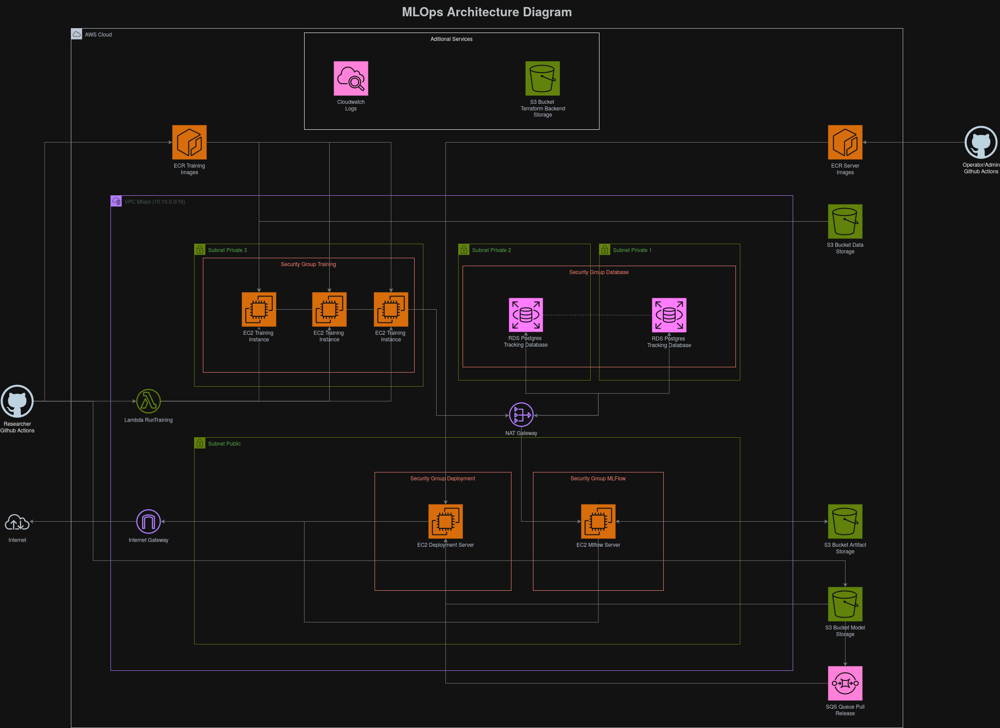

# Arquitectura de la infraestructura

## Funcionamiento de la Infraestructura
La arquitectura está diseñada alrededor de un flujo de trabajo MLOps, el cuál ha sido dividido en las siguientes capas:
* Almacenamiento de datos.
* Entrenamiento y Experimentación.
* Pipeline de automatización.
* Revisión y aprovación de modelos.
* Despliegue de modelos

### Almacenamiento de datos
Se usan Buckets de S3 como medio principal de almacenamiento. Con una bucket para almacenamiento de datos de entrenamiento y prueba, una para almacenamiento de modelos y otra para el almacenamiento de artefactos de MLFlow

### Entrenamiento y Experimentación
Para esta capa se usan instancias de EC2 generadas por funciones lambda que son llamadas por los proyectos de investigación para realizar el entrenamiento y las pruebas. El modelo generado y las metricas obtenidas luego son registradas en el servidor de MLFlow.

### Pipeline de Automatización
Se usa Github Actions para la atomatización del entrenamiento y despliegue de los modelos desarrollados por cada proyecto.

### Revisión y aprovación de modelos
Los modelos entrenados son registrados en el servidor de MLFlow. El cual es una instancia EC2 donde se ejecuta el programa de MLFlow; conectada a una Bucket S3 y una base de datos PostgreSQL donde se guardan los artefactos generados por los entrenamientos y los registros de los entrenamientos respectivamente.

En este servidor se pueden visualizar los resultados de los entrenamientos y registrar los modelos para poder deplegarlos al servidor de despliegue.

### Despliegue de modelos
Se usa una instancia EC2 que se sincroniza con la Bucket de almacenamiento de modelos para preveer los modelos registrados en MLFlow de una forma más directa. Este despliegue se realiza de forma manual a travéz de Github Actions.

## Componentes de la infraestructura
A continuación se enlistan los componentes principales que conforman la infraestructura levantada por terraform.

### S3 Buckets
* Bucket de datos de entrenamiento y prueba.
* Bucket de artefactos de MLFlow.
* Bucket de modelos desplegados.
* Bucket de Terraform State.

### Base de datos RDS
* Base de datos PortgreSQL para MLFlow.

### Instancias EC2
* Sevidor de MLOps.
* Servidor de Despliegue.

### VPC
* Red VPC
* Subredes privadas para la base de datos y las instancias de entrenamiento.
* Subredes públicas para los servidores de MLFlow y de despliegue.
* Internet Gateway para acceso al exterior de la infraestructura.
* NAT Gateway para comunicación de red interna.
* Security Groups para las instancias EC2 y la base de datos.

### Repositorios ECR
* Repositorio de la imagen Docker usada por el servidor de despliegue.
* Repositorios de imagenes Docker de tntrenamiento de los proyectos integrados.

### Funciones Lambda
* Funciones de creación de intancias de entrenamiento.

### Notificaciones SQS
* Cola de notificaciones de modelos subidos a la Bucket de modelos desplegados.

### Cloudwatch
* Seguimiento de las instancias de entrenamiento.
