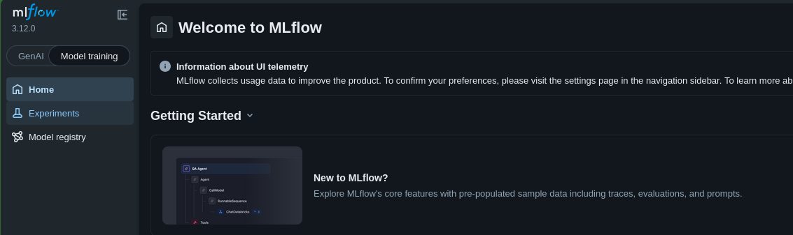
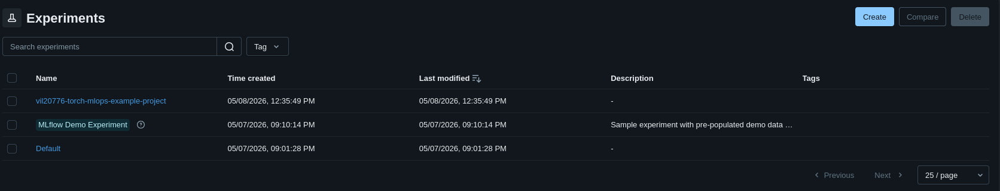
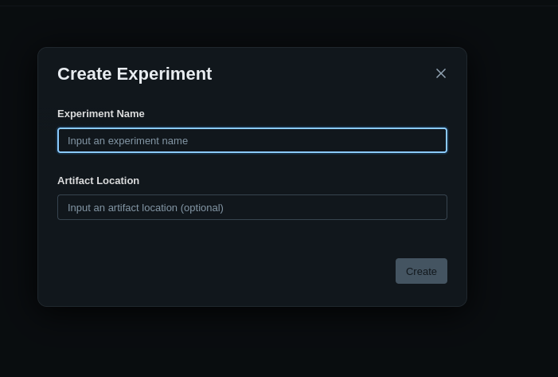

# Integración de proyectos

## Integración a la infraesteuctura
La integración de nuevos proyectos se define en la variable `mlops-users` en el archivo terraform.tfvars.
La variable es un diccionario de objetos, donde cada entrada sigue la siguiente estructura:

```
# users.tfvars
mlops-users = {
    "<USUARIO_AWS>" = {
        "repo" = "<REPOSITORIO>"
        "project" = "<ID_DE_PROYECTO>"
    },
}
```

* **USUARIO_AWS:** Puede tomar cualquier valor, pero es recomendable usar la identificación de AWS.
* **REPOSITORIO:** ruta del repositorio de github siguiendo la estructura `<Usuario/Organización>/<Nombre del Repositorio>`.
* **ID_DE_PROYECTO:** Nombre que identifica al proyecto de manera única.
Los caracteres en minúscula, números y el simbolo '-' son válidos para el nombre, pero cualquier otro caracter hará que terraform falle al integrar el proyecto a la infraestructura.
El nombre puede ser cualquiera, pero se recomienda seguir la siguiente estructura para facilitar la identificación de los proyectos: `<Usuario>-<Libreria ML>-<Nombre del repositorio>`.

Para guardar el archivo users.tfvars. Ejecute el commando `./scripts/backup_users.sh` desde el direcotrio raíz del repositorio o suba de forma manual el archivo `terraform.tfvars` a la Bucket S3 definida para el backend de terraform.
Finalmente, ejecute el workflow **Deploy and Update Infraestructure** para hacer efectivos sus cambios.

## Integración a MLFlow
Antes de que el usuario investigador pueda usar la infraestructura, es necesario registrar el proyecto como un experimento en MLFlow.
1. Ingrese a la interfaz web a travez de la URI del servidor de MLFlow en su navegador de preferencia y haga click en la pestaña de Experiments.

2. Verá la ventana de Experimentos registrados, estos son todos los proyectos de los que MLFlow es conciente. Para registar un nuevo proyecto, haga click en el botón Create.

3. Finalmente, en el campo "Experiment Name" ingrese el id de proyecto definido en  para el usuario. Deje el campo "Artifact Location" en blanco.


